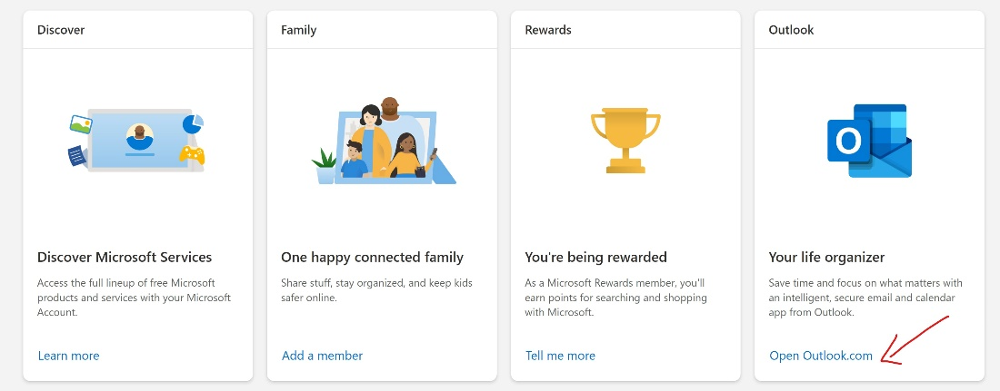
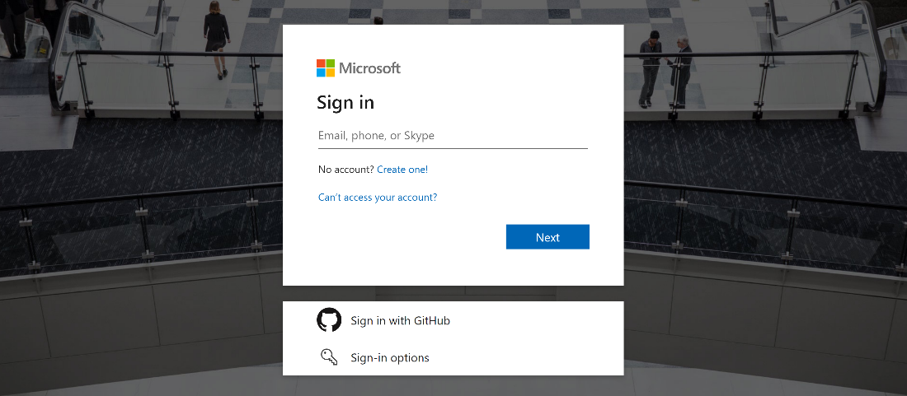
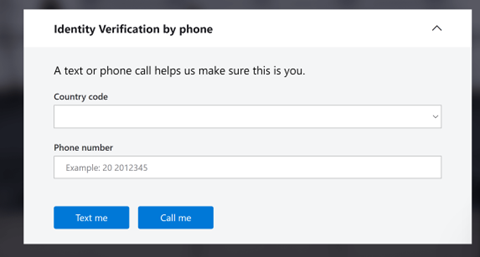
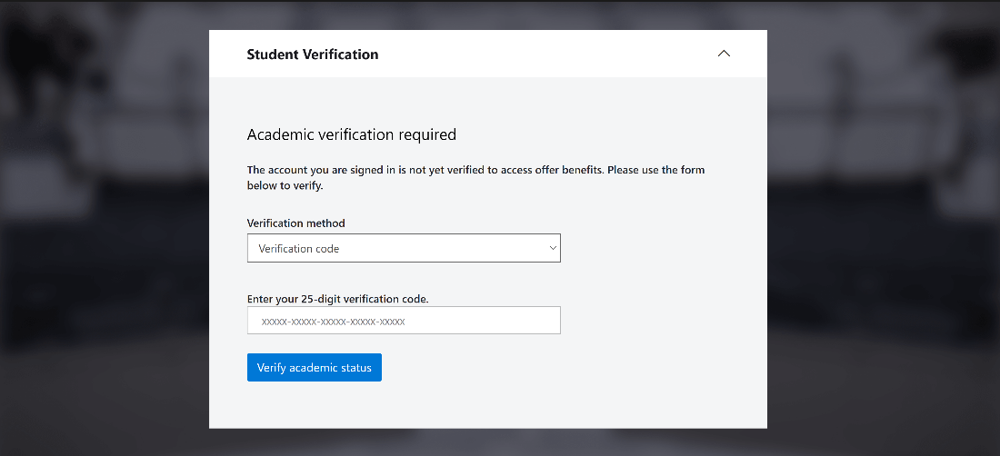
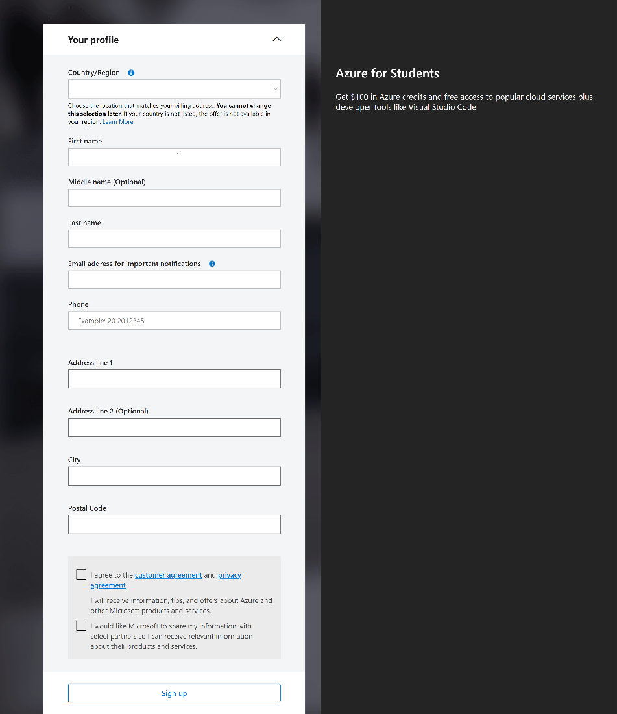
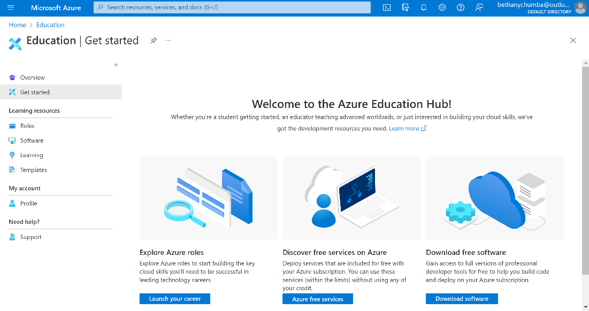
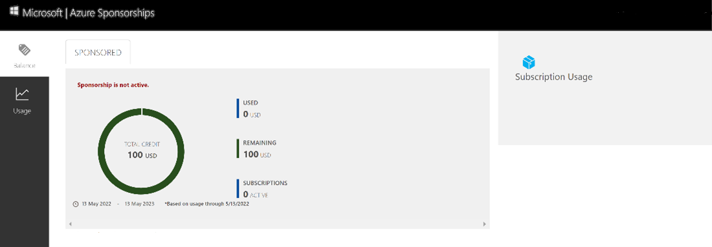

+++
title = "Redeeming Azure for Student Credits"
date = "2022-07-25 16:23:13"
tags = [
    "community",
    "students",
    "azure",
]
+++

As a student you get free $100 Azure credits and over 25 Azure services for free. How do you redeem this benefit using an Azure verification code?
<!--more-->

Creating an Azure subscription is a three-step process.

1. Create a new [outlook.com](https://outlook.com) email account (skip this step if you already have an outlook account)
2. Redeem your Verification Code
3. Activate your subscription

# Step 1: Create a new Outlook.com email account:

- Open a new **In-Private Browser** session and navigate to [https://signup.live.com](https://signup.live.com/) and create a new Outlook.com email account
- Add in the email address you would like to use - if the username is not available Microsoft will offer several suggestions
- Create a new password for the account
- Add in your full name.
- Add in your country/region and date of birth and validate using Captcha
- The account will be created
- Scroll down and select “open outlook.com”

# Step 2: Redeeming a Microsoft Azure Verification Code:

- Open a new **In-Private Browser** session and navigate to: [http://aka.ms/azure4students](http://aka.ms/azure4students)

It is recommended you close all browsers and open a new In-Private Browser

session. Other logins can persist and cause errors during the activation step.

- Click the **Start Free** button to get started.
- Enter your account login information and select “Next”.

- Verify your identity with a phone number

- Select verification method by Verification Code. Enter your 25-character verification code and click “Verify Academic Status”.

- It may take up to 5 minutes to process the redemption.

# Step 3: Activate your subscription:

- When the redemption process is completed, it will redirect to the sign-up page.
- Enter your account information and click the agreement check box and click the Sign-up button.

- It may take a few minutes to process the request. Once done, take a minute to give feedback on the process.
- Your Azure subscription is ready

- You can check the balance of your Azure Pass Credits

on [https://www.microsoftazuresponsorships.com/balance](https://www.microsoftazuresponsorships.com/balance)

