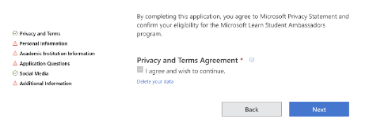

+++
title = "Becoming a Microsoft Learn Student Ambassador (MLSA)"
date = "2022-06-25 16:23:13"
tags = [
    "community",
    "mlsa",
]
+++

The Microsoft Learn Student Ambassador (MLSA) program is a community of students from all over the world who empower themselves and fellow students through learning new skills and building communities.
<!--more-->

> 💡 *As Robin Hobb said, Home is people, not a place. This is what I have found in the MLSA Community, My Tech Home, where I constantly interact with amazing people, ever ready to assist and challenge you to take those risks and be a better version of yourself. - Consolata Gicheru, Beta MLSA*

### **Benefits of becoming an MLSA**

The Student Ambassador program gives you an opportunity to:

- Learn new skills through free access to Microsoft certificates, Microsoft Cloud Advocates and LinkedIn Learn.

> 💡 *It has been an amazing experience which has equipped me with public speaking, management, and various technical skills. - Gloria Keya, Beta MLSA*

- Become a leader in your school by hosting events and organizing hackathons to solve real world problems.

> 💡 *I have been able to inspire more people from a non-technical background just like me into this growing world of tech – Shadrach Kiprotich, Beta MLSA*

- Network with a global community which strengthens your connections and advances your career.

> 💡 *Being an MLSA is a blessing since I get to network with impactful individuals around this community. My one year in the program has made me increase my technical skills and my soft skills and above all my leadership skills. - Anselmo Flavian, Gold MLSA*

- Swag benefits including $150 monthly Azure credits, free Name.com domain, and swag kits.

{{ $image := .Resources.GetMatch "Untitled.png" }}

### **Program Eligibility and Timelines**

The program is open to all students over 16 years enrolled full-time in an accredited academic institution. You can apply at any time throughout the year, however, applications are reviewed and accepted quarterly. For example, if you apply after 28th February 2022 your application will be reviewed, and results announced in July 2022.

 > *"💡Joining the Microsoft learn student's ambassador program was the best thing that happened to me in my career life. I can say proudly I found my community where we impact by learning, leading, and building innovative solutions" - Humphry, Alpha MLSA*

### **Applying to the MLSA Program**

How do you become an MLSA? To apply to the program, you can follow the following steps:

- Go to [Microsoft Learn Student Ambassadors](https://studentambassadors.microsoft.com/)
- Click the **Apply Now** button to start your application.

- Login to the platform using your Microsoft account.

- Once logged in you will be redirected to the application form. The application is divided into 6 parts:
    - **Privacy and Terms**: Read through the privacy and agreement, once done agree to the terms then continue to the next section.
    
    
    
    - **Personal Information:** correctly fill in your personal details.
    - **Academic Institution Information:** provide details of your school and accepted graduation date. The program is open to all students regardless of their degrees and/or majors.
    
    
    
    - **Application Questions:** 
    This is the most important section of the whole application. You are required to make one video and write two written samples to demonstrate your passion and desire to join the program. The three questions are on: **Inspire, Teach** and **Promote.** 
    The good news is you chose how to answer the questions, whether through video or written. Therefore, the first step is to choose which question you would like to answer using a video.
        
        
        
        Once you have selected the video you would like to submit, go ahead, and record your video. You can upload it to YouTube or OneDrive and submit the link to the video.
        
        Next, fill in the written samples.
        
        
        
        **Tips:** 
        
        - Demonstrate passion in your answers. For instance, when responding to Inspire (how have you acted as an agent of change?), give examples of some activities you have previously been involved in.
        - Make sure your answers are honest and ensure to include your achievements or projects you are working on.
    - **Social Media:** add links to your social media profiles. The links will be used in your student ambassador profile if your application is accepted.
    - **Additional Information:** do you have any other additional information you would like to share with the selection team? This is the right place to input them, including technologies you are passionate about.
- Once you are done, click submit to finish your application. Remember, if you can come back and edit your application until it is in review phase.

### **Before you go:**

First, if you get a rejection, you can reapply to the program. Do not let rejection put you down. Secondly, have you worked together with a student ambassador? You can reach out to them and ask them for a nomination!

> 💡 *The program provides you with an enriching environment to make a difference around the world, become a leader in your local community and empower your peers, and make lifelong friends 😊 - Maryann Gitonga, Beta MLSA*

**[Apply](https://studentambassadors.microsoft.com/en-US/apply) now to become a student ambassador.**