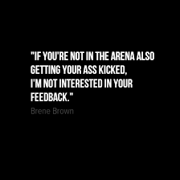

A mentor is someone who has walked the path before you and is tasked to guide you to navigate the path easier. They already know the loopholes ahead; they've been there and done that. Their role is not to dictate what is right or wrong but to enlighten you to make your decision wiser. Knowledge induced by mentors is out of this world.

I have had the chance to be part of several mentorship programs, but today I'll be talking about [wentors](https://www.wentors.com/). A few weeks before International Women's Day in 2021, an announcement was made on the Women Evolve WhatsApp group. It was a collaboration between the community and wentor. Wentors provides a platform for young women in tech to be mentored by more experienced industry professionals. I was matched with ****[Theresa (Theo) Kauffeld](https://www.linkedin.com/in/theresakauffeld/),** below are some nuggets I got from her.

## Product Management

Tips on Product Management

- Use program management tools e.g. Asana [Large projects] and Trello to streamline your projects.  Why? For visualization to track your projects and create rough time estimates, for communication of clear milestones, daily updates, and check-in.
- Creating a product ROADMAP: have an overview of milestones and breakdown tasks
- Check-in on your team always.  Be specific when on deadlines and offer support information to your team. Finally, when stuck reframe your solutions and to help them succeed.
- Minimal Loveable Product (MLP) - what makes the product loveable?
    - small functionality based on the target audience
    - User-centred (user-perspective)

Characteristics of Minimal LOVEABLE Product:

- Driven by desirability
- Focused & Time-boxed
- Output-driven
- Close Feedback & Collaboration

> 💡 The goal for **MVP -** not more than five features that are users first - focus on functionality.

Promoting your product: - make people see it as a problem for them. Give concrete examples that are relatable and makes them curious.

## Personal Management

This exercise helps you to identify how to spend your time wisely on keep you focused on what you want to achieve:

- **Step 1:**  You write down 3-5 goals for 2022 for each of the eight categories in the picture. Make the goals SMART (Specific, Measurable, Achievable, Realistic, Timely)
- **Step 2:**  Out of all goals that you have written down, choose only three as your priority goals for 2021

On saying no: find a good reason and be polite.

> 💡 Remember: saying no to one thing is saying yes to another

On receiving feedback: “It is always easy to criticize from the side-lines when you are not doing it yourself, so I am only accepting feedback from users or from people that are doing what I am doing because they know the difficulties.” 

## Product Design

on your portfolio

- Have your design skills shine. As you create your portfolio think of the user experience and interface of your portfolio, ensure your designs shine.
- Design and Presentation your case study, don’t just write text but use your designs to add context. Make it more visual, less text based.
- Use videos instead of embedding Figma files, remember, show your design don't make them look hard to find your designs.
- Ask yourself, is it clear for the user or can I make it clearer?
- Guide them on what they're seeing.
- Avoid grammar errors - use Grammarly or Microsoft Editor
- Check for accessibility using Adobe Suite.

on designer developer hand-off

- Design a grid with rules - A grid is not there to make the design easy but make them readable to the developers
- On building a design system - Check what others are doing e.g., on the grids and margins, colours, components, etc. and add them to your design.
- Read more on: Human interface design and material design.

on interviewing a designer:

- As a designer, be humble - put your ego aside.
- Give a reason behind the design, explain the **WHY.**
- Explain the process you took to create your design.
- Remember the client likes your design, they just want to know more.

> 💡 Presenting the information to steer the outcome - don't make them think, tell them what they should get from this

Thank you, and I hope this will be helpful in your journey as a Product Designer/Manager