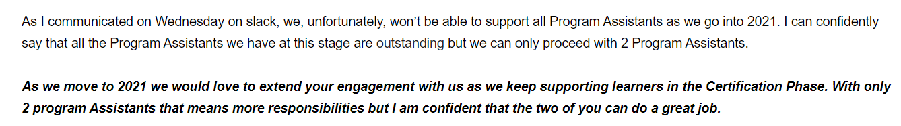
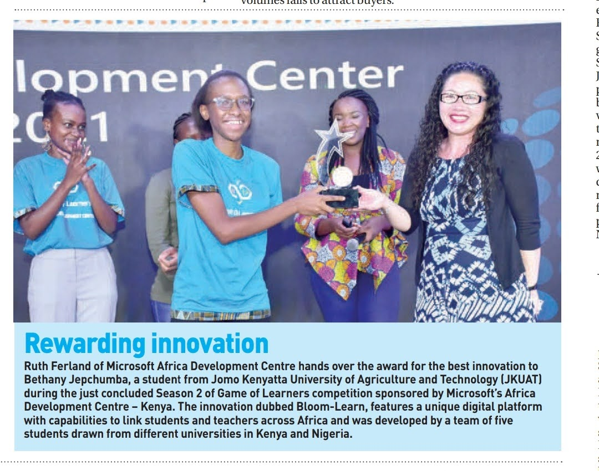
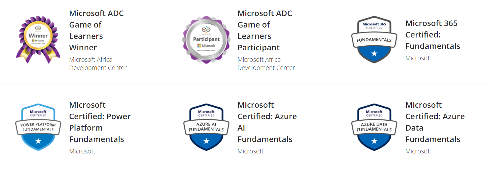
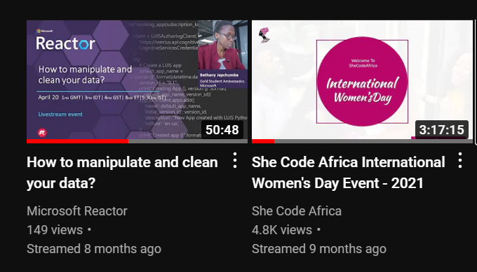
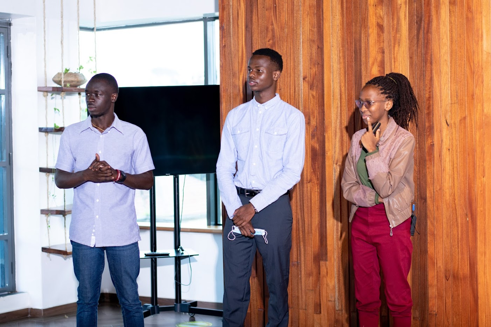
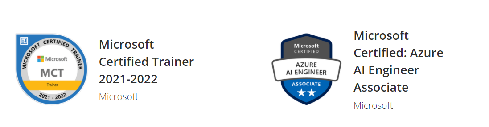

Do you believe in Miracles? According to the Oxford Dictionary, a miracle is “a lucky thing that happens that you did not expect, or think was possible.” A miracle is believed to be a supernatural happening, and in most cases, caused by a supernatural being. For me, 2021 was nothing short of a miracle. 

> 💡 
>
>  I've got miracles on miracles;
>
>    Miracles on miracles
>
> (A Million Little Miracles by Maverick City.)

One transition after the other and it kept getting better and better. In this review, I’ll outline some major events that took place over 2021 in each quarter. I’ll also talk of the different failures and wins and how God came through even when I least expected it. Let’s dive in! 

## Jan-April

As 2020 ended, I was invited to continue supporting [GADS](https://gads.andela.com/) learners as a Program Assistant in 2021. Being among the two out of seventeen other assistants to proceed was indeed a win.

Other than supporting GADS, in January I did my 4.1 exams physically after studying the semester online. Additionally, I sat for four Azure Fundamentals Exams in this quarter and well, I didn’t fail. One failure though is being unable to take Associate Level certifications due to my incurable fear of failure. 

Another mountain I climbed was the [Game of Learners](https://www.microsoft.com/MEA/Gameoflearners/) competition. Being a [Gold Microsoft Learn Student Ambassador](http://aka.ms/studentambassadors), I was a team Lead in the one-month hackathon, something that led me to appreciate my Program Management skills and consider it for a future career path. You can learn more on my journey, the highs and lows and everything in between [here](https://www.bethanyjep.com/blog/gol-experience/), as well as how through the program I was able to learn how [to adapt to change](https://www.youtube.com/watch?v=rgPLy4PkepA&t=1453s).

### Summary of the Wins

Below are some other wins during the quarter:

- I had two major talks with [SCA Africa](https://www.youtube.com/watch?v=l36WD9ZTuEE) and [Microsoft Reactor Tel Aviv](https://www.youtube.com/watch?v=ZbVBbXn3P9I&t=1421s).
- I together with other ambassadors, created an open-source challenge: [Season of Serverless](https://github.com/microsoft/Seasons-of-Serverless).
- My university featured me in an [article.](http://www.jkuat.ac.ke/jkuat-students-team-tops-2021-microsoft-hackathon/)
- Co-Organized [Global Power Platform Bootcamp](https://www.powerplatformbootcamp.com/2021/location-detail/?id=7fc56d39-073f-eb11-8fed-281878f664b1&city=Nairobi), Nairobi.
- Landed a UI/UX Design role at Jiwe Studios
- Got into Wentors Mentorship to grow my skills in PM and Design.

### Summary of Losses

However, it was not all sunshine and rainbows. Here are some major failures:

- I was unable to complete KamiLimu projects and let my teammates down.
- Did a couple of interviews with Kwara & Mideva Labs and unable to secure a role.
- Realized I really have really tough time management skills and an inability to say no.

## May-August

The mid-months of the year were about transitions. Finishing my final year, graduating from [KamiLimu](https://www.kamilimu.org/) and the launch of [GADS 2021](https://www.pluralsight.com/partners/google/africa/gads-2021?aid=7010a000002LUv2AAG&promo=&utm_source=non_branded&utm_medium=digital_paid_search_google&utm_campaign=XYZ_EMEA_Dynamic&utm_content=&cq_cmp=1576650371). Resilience was my key motivator, staying afloat on all areas in life as well as finding time for rest.

### Summary of Wins

- Started a new part-time role as a GOL Ambassador at Microsoft ADC
- Joined For Creative Girls 2021 Mentorship Program!
- I finished my last semester coursework and exams in school.

### Summary of Losses

- Was unable to maximize my mentorship time during the For Creatives Mentorship program
- Submitted my final year project late, our class was deferred. Additionally, I had some missing marks
- Quit my role at Jiwe IO, after being very overwhelmed with trying to graduate and working two different roles.

## September-December

Have you ever reached your limit, and gave up. During this period, I reached my limit and gave up on ever graduating. However, miracles came through, I was able to graduate after 4 years in JKUAT. 

### Summary of Wins

- Became Microsoft Certified: Azure AI Engineer Associate and MCT
    
    
    
- I [graduated](https://twitter.com/BethanyJep/status/1464144481180082195?s=20) from Jomo Kenyatta University of Agriculture and Technology.
- Got featured in a blog series highlighting **[Microsoft Learn Student Ambassadors](https://techcommunity.microsoft.com/t5/student-developer-blog/meet-a-recent-microsoft-learn-student-ambassador-graduate/ba-p/3034377)** who achieved the Gold milestone and have recently graduated from university.
- Wrote [documentation](https://bethanyjep.github.io/Make-Code-Documentation/#/) on MakeCode 101. I later used the documentation to guide my cousin into building his first game 🤯.

### Summary of Losses

- Had a lot of challenges trying to graduate and was often stressed. I did not handle it so well as my work suffered and performance declined.

## 2022 Goals and Aspirations

> 💡 Yes, doing a year in review a month in is unheard of, but one thing I know, doing the same thing expecting different results is insanity. (Albert Einstein) Therefore, reflecting on the year past is key in looking forward.

2022 already started on a very low note for me. I received two rejections from my dream role and now am questioning what next. However, I intend to focus more on community and content. I started with re-doing my [blog](https://www.bethanyjep.com/) with Gatsby. I cannot wait for what lies ahead!