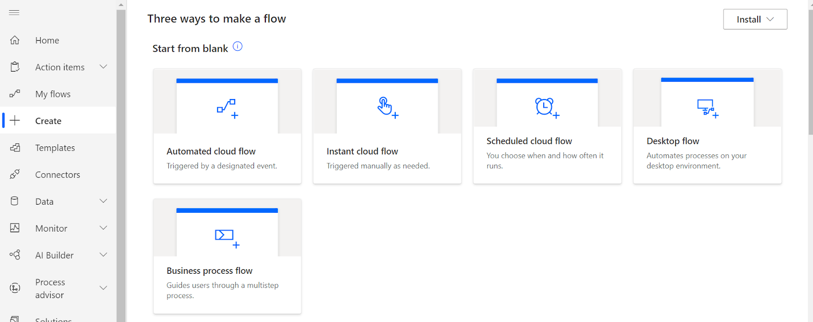
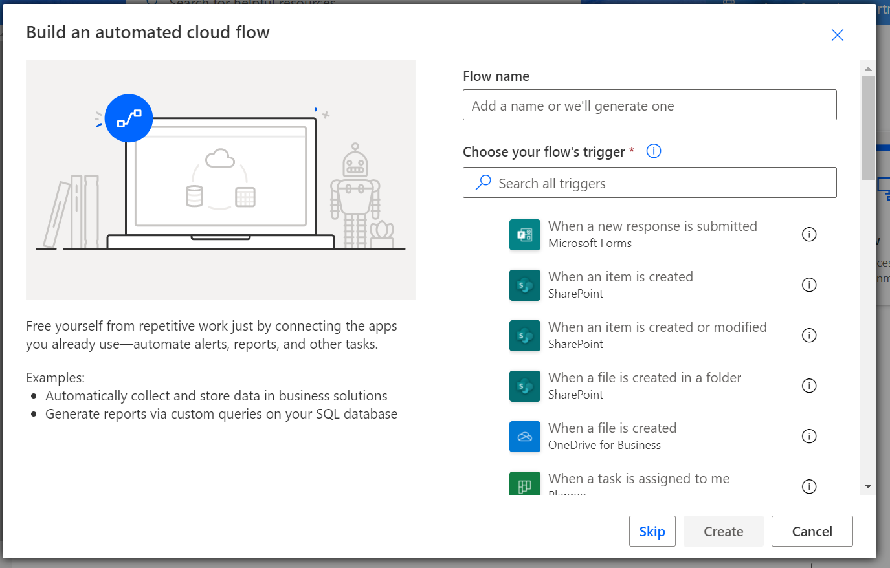
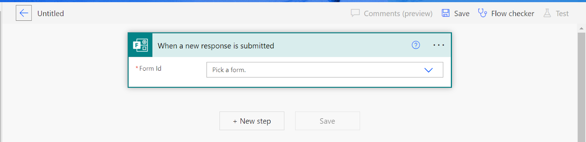
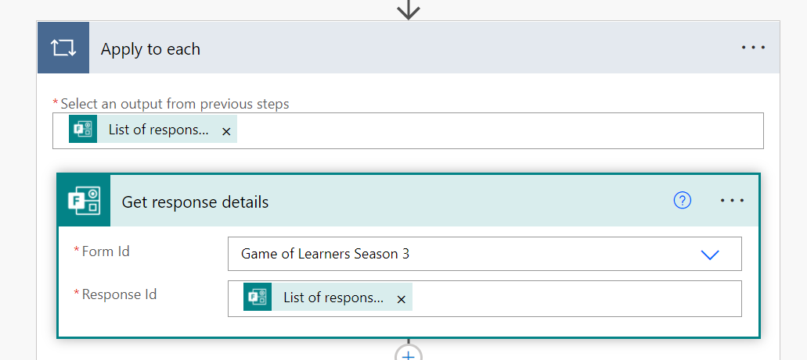
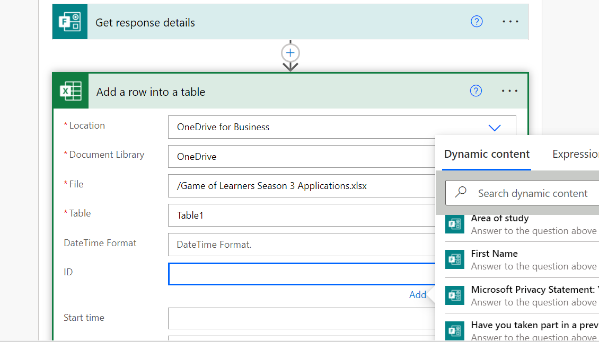
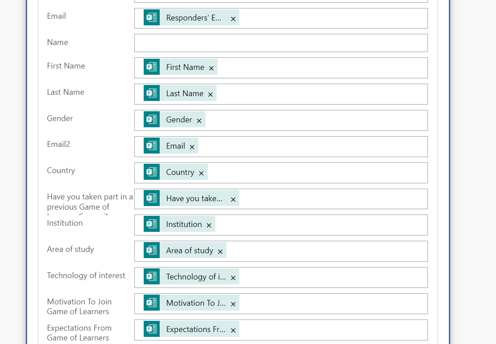
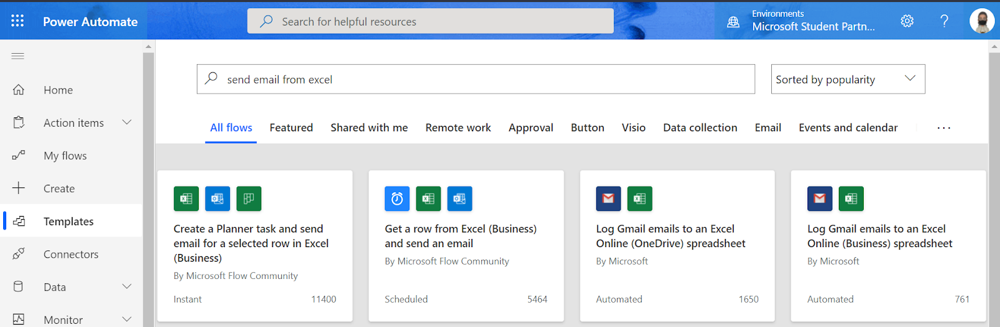

Do you have emails that you want to send out to event registrants? Is it manually tasking to send each of them one by one? Fear not, Power Automate is here to save time and rescue you from doing repetitive tasks over and over again. One of the joys of having a Microsoft 365 Account is the ability to automate workflows, display applications and analyze data while linking the different apps together. In this guide, I will take you through some automations and processes we made use of as a [Game of Learners](https://aka.ms/gameoflearners) Ambassadors. Additionally, I will include resources to guide you in your next steps.

## **Automated Flow:** Connecting Forms to Excel

As a community manager, most of the time, you will find yourself collecting data from participants. Some case scenarios for this include: RSVP for events, feedback on ongoing programs, registration for different programs and so on and so forth. Let’s take the case for Game of Learners Season applications.  As the data streams in over a period of time, you might need to evaluate the data collected or contact the participants. Therefore, you will require to connect the data from the forms to an excel file. How do you do this? Here are the steps involved:

**Step 1:** go to [Power Automate](https://us.flow.microsoft.com/) and create a new flow. (click the create button on your left)

**Step 2:** Create an automated cloud flow. The flow will be triggered automatically when one responds to the form.

**Step 3:** A flow has a trigger followed by different actions. As you create the flow, indicate the trigger and give your flow a name

**Step 4:**

Once your flow is created, you are redirected to continue developing your flow. The designer allows you to add new steps and state what happens at each stage. First, the flow starts when a response is submitted to your form. Therefore, the first step is to indicate which form you want to automate

**Step 5:** In our case, we’re automating the Game Of Learners Season 3 form. We want the flow to run whenever a new response is submitted. Therefore the next step is to call the response details from the form. This is an action to fetch the responses submitted through the form

**Step 6:** Once you get the responses, you add them to your excel form. In our case, we will be using the GOL Sn3 Applications Excel file. You will be required to connect to your one drive. As I have the fields in the excel file already existing, I will match the responses to the corresponding fields. In case you do not have an existing excel file, create a new file then add the different fields as columns. After that, convert the excel sheet into a table and connect to the file.

**Step 8:** You can now test your flow to check if it is working.

## **Templates:** Using pre-existing flows

You do not have to create all your flows from scratch. There are some existing templates you can use to automate your work. For instance, let’s say you want to send emails to learners from the excel file you created above. How do you go about it? Head over to [Power Automate](https://us.flow.microsoft.com/), on your left select Templates and search for one that enables you to send emails from a selected excel form. From there you can customize the flow to meet your needs.

## **Instant Cloud Flow:** Sending emails

Once a participant has registered for the event, you might want to reach out to them in future to update them on the event progress. Therefore, the next flow we will be creating will be sending emails. I have created a video for this. Check it out at:

<iframe width="560" height="315" src="https://www.youtube.com/embed/jX-th_iW_ho" title="YouTube video player" frameborder="0" allow="accelerometer; autoplay; clipboard-write; encrypted-media; gyroscope; picture-in-picture" allowfullscreen></iframe>

## **Resources and Next Steps**

- Learn more on Power Automate Documentation and Microsoft Learn at [https://docs.microsoft.com/en-us/power-automate/](https://docs.microsoft.com/en-us/power-automate/)
- Watch Power Automate YouTube Channel: [https://www.youtube.com/c/MicrosoftFlow/featured](https://www.youtube.com/c/MicrosoftFlow/featured)
- Build your flows: [https://us.flow.microsoft.com/en-us/](https://us.flow.microsoft.com/en-us/)
- Join the power platform community: [https://powerusers.microsoft.com/t5/Microsoft-Power-Automate/ct-p/MPACommunity](https://powerusers.microsoft.com/t5/Microsoft-Power-Automate/ct-p/MPACommunity)

## In my next tutorial, I will cover:

- Sending and Signing NDAs, once you sign it updates excel file.